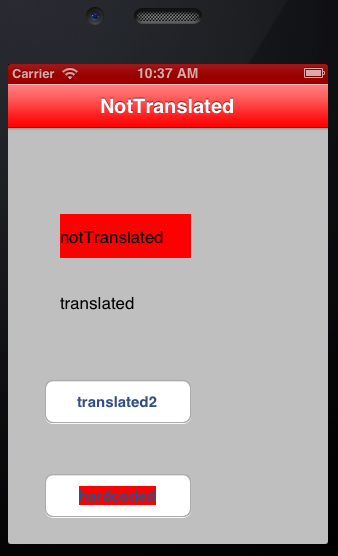

iOS-LocalizationsChecker
========================

Did your localizations suck first time you changed language in your iOS App? Is it a hell to know where you miss localized strings? This utility is for you!

##Motivation:
When you write an iOS app, you need some things for localized strings to show in languages other than default:
- Code calling NSLocalizedString (or other API) to read a different string using a key
- A file in correct directory in bundle
- A string matching the key in the file!

This breaks. **A LOT**. When sources, UI, strings, wireframes, and requirements change, in multiplatform projects. 
When a string is not found, system replaces with default language one, or with programmer-supplied default.

**We want to ease the pain of finding where you forgot to add your strings.**

##Usage
1. Add the 'checker' files to your project compile phase. 
1. Enjoy! It will work automatically! ;)

The library will monitor calls to load strings from NSBundle, and all text setters in your UI. If there is a mismatch between them, it means string is hardcoded, or there was no translation! This is achieved through Objective-C's coolest dynamic features: categories, object introspection, method sizzling and so. Fancy, uh?

##Result
1. While running your application, the framework will highlight in red **ALL** it's UI texts that are not localized. This is how it looks:

1. It will also display in console a list of the strings missing localization.

##Future Work:
- Could customize a set of strings (for example km/h), which are not translated
- Could check other things, like text doesn't fit the label frame.
- Could generate a full report telling you which class/code files loaded strings without localization.
 
##Contribution:
- Feel free to fork the repository and play with it. And don't be shy! We would love to include some neat push requests of yours!
- If you detect any bug or nasty behaviour, raise an issue! We want to put some effort into this to be a usable tool for you.

##Developers:

- Miguel Quinones
- Pawel Wrzosek
- Tomek Wyszomirski
- Hector Zarate

This component was first developed as a 4 hour fast hacking for the [Name Collision Hackaton](http://www.namecollision.pl). 
Original objectives and motivation [here](https://www.hackerleague.org/hackathons/name-collision/hacks/ios-localizations-checker).
